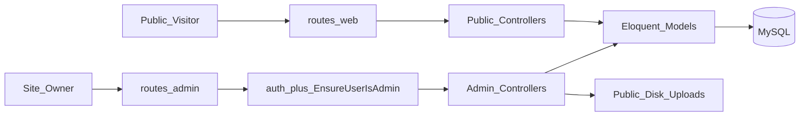
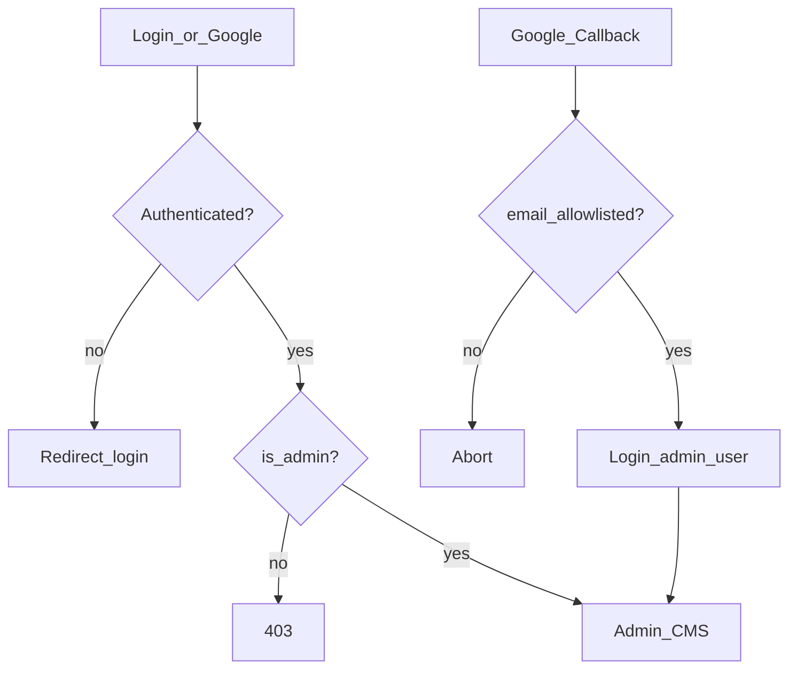
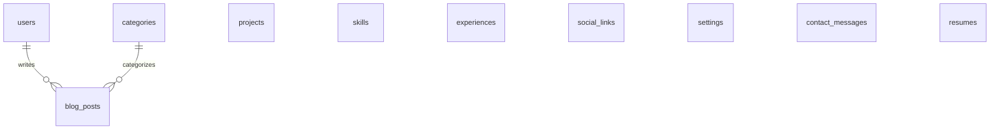

# 02 — Architecture

**Purpose:** Official architecture specification for the Laravel Portfolio CMS.  
**Status:** Approved (Tech Lead review 2026-07-23 — Approve with Changes adopted).  
**Rule:** Do **not** redesign casually. Update this document when architecture changes, and record an ADR in [06-decisions](06-decisions.md).

**Related:** [00-CONSTITUTION](00-CONSTITUTION.md) · [03-database](03-database.md) · [11-folder-structure](11-folder-structure.md) · [14-security](14-security.md) · [09-roadmap](09-roadmap.md)

---

## Table of contents

1. [Context](#1-context)
2. [Product shape](#2-product-shape)
3. [Feature map](#3-feature-map)
4. [High-level system](#4-high-level-system)
5. [Authentication and authorization](#5-authentication-and-authorization)
6. [Application layers](#6-application-layers)
7. [Routing](#7-routing)
8. [Data model summary](#8-data-model-summary)
9. [Settings and cache](#9-settings-and-cache)
10. [Content rendering](#10-content-rendering)
11. [UI architecture](#11-ui-architecture)
12. [Asset pipeline](#12-asset-pipeline)
13. [Explicit non-goals](#13-explicit-non-goals)
14. [Future expansion](#14-future-expansion)

---

## 1. Context

The repository began as a **Laravel 12 skeleton** (not a pre-existing static site). Tailwind shipped with the skeleton and **must be removed** in Phase 0 in favor of Bootstrap 5.

Stay on **Laravel 12**. Do not chase a hypothetical Laravel 13 for this project.

---

## 2. Product shape

| Audience | Surface |
|----------|---------|
| Public visitors | Multi-page portfolio site |
| Owner | Private CMS at `/admin` |

Single owner. No multi-tenant SaaS. No visitor accounts.

**Why:** One operator needs CRUD and publishing—not roles matrices or marketplace features.

---

## 3. Feature map

### Public

| Page | Behavior |
|------|----------|
| Home | Hero from settings + featured projects + latest posts + CTA |
| About | Bio / photo from settings |
| Experience | Chronological published list |
| Skills | Grouped by `category` string |
| Projects | Index + show by slug |
| Blog | Index + show by slug; optional category filter |
| Contact | Form → `contact_messages` + throttle |
| Resume | Download active PDF |

### Admin (`/admin`)

- Dashboard (counts: projects, posts, unread messages)
- CRUD: Projects, Blog Posts, Categories, Skills, Experience, Social Links
- Resume upload / replace / activate
- Site Settings (key-value)
- Contact Messages (list, mark read, delete)
- Logout / profile basics

### Auth

- Email + password **login only** (no public registration)
- Google OAuth via Socialite, restricted by allowlisted email
- Admin access requires `users.is_admin = true`

---

## 4. High-level system

---

## 5. Authentication and authorization

### Rules

1. **No Breeze Blade** — Breeze’s Blade stack is Tailwind-first and conflicts with Bootstrap-only.
2. **Manual auth views** for login, styled with Bootstrap.
3. **Registration disabled** — no public register routes.
4. **Middleware `EnsureUserIsAdmin`** on all `/admin/*` routes (in addition to `auth`).
5. **Google:** Socialite callback must reject emails not in `ADMIN_GOOGLE_EMAIL` (config); user must be admin.

**Why `is_admin` and allowlist:** Defense in depth. Allowlist guards OAuth; flag guards every admin request even if an extra user row appears.

---

## 6. Application layers

Allowed:

- Controllers (thin)
- Eloquent Models (+ scopes)
- Form Requests
- Middleware
- Blade views / components
- Optional View Composers for footer/nav shared data

Forbidden by default:

- Repository Pattern
- Service Layer
- CQRS / DDD / Hexagonal / Event Sourcing
- Filament / Nova / Livewire / SPA frameworks

**Why:** Controllers + Models + Form Requests are enough for single-owner CRUD. Extract a service only after proven duplication and an ADR approval.

---

## 7. Routing

| File | Responsibility |
|------|----------------|
| `routes/web.php` | Public pages, login, Google OAuth, resume download, contact POST |
| `routes/admin.php` | All `/admin` resources, loaded with `auth` + `EnsureUserIsAdmin` |

Named routes:

- Public: `home`, `about`, `projects.index`, `projects.show`, …
- Admin: `admin.dashboard`, `admin.projects.index`, …

**Why split files:** Keeps public and CMS concerns readable as the app grows.

---

## 8. Data model summary

Canonical schema detail: [03-database](03-database.md).

| Entity | Soft deletes | Notes |
|--------|--------------|-------|
| User | No (stock) | `is_admin`, `google_id`, `avatar` |
| Project | Yes | `tech_stack` JSON; featured/published |
| BlogPost | Yes | Markdown `body`; belongs to Category |
| Category | No | Blog only |
| Skill | No | `category` string |
| Experience | Yes | Null `end_date` = current |
| SocialLink | No | Icon = Bootstrap Icons class |
| Setting | No | Key-value + cache |
| ContactMessage | No | Hard delete |
| Resume | No | One `is_active` enforced in app |

Deferred tables (do not create in v1): `project_images`, analytics events, API tokens, per-entity SEO tables.

---

## 9. Settings and cache

- Table: `settings` (`key` unique, `value` text nullable)
- Access: `Setting::get('site_name')` / `Setting::set('site_name', $value)`
- Cache: remember full map (e.g. key `settings.all`); **bust on any update**

**Why key-value:** New copy/SEO fields without migrations.  
**Why cache:** Settings load on nearly every public page.

---

## 10. Content rendering

- Long-form fields (`blog_posts.body`, about bio, experience description) stored as **Markdown**
- Render with Laravel’s Markdown helper (escaped HTML subset)
- Do not store arbitrary raw HTML as the default authoring format

**Why:** Reduces XSS surface versus `{!! $html !!}` while remaining practical for a personal site.

---

## 11. UI architecture

Layouts:

- `layouts/public.blade.php` — navbar, flash, footer
- `layouts/admin.blade.php` — sidebar, topbar, content
- `layouts/auth.blade.php` — centered login card

Shared Blade components: see [12-components](12-components.md).  
Visual tokens: see [13-design-system](13-design-system.md).

Theme: **light only for v1**. CSS variables reserved for a future dark theme.

Paginator: Bootstrap 5 (`Paginator::useBootstrapFive()`).

---

## 12. Asset pipeline

| Choice | Status |
|--------|--------|
| Vite + npm | Required |
| Bootstrap 5 + Bootstrap Icons | Required |
| Vanilla JS in `resources/js` | Required |
| Tailwind | Remove |
| CDN-only Bootstrap for production | Rejected (version drift) |

**Why npm + Vite:** Version-locked assets, works with Laravel’s default tooling, reproducible builds.

---

## 13. Explicit non-goals

- Multi-admin RBAC packages
- Filament / Nova
- Tailwind / Livewire / Vue / React / SPA
- Repository / Service layers (unless ADR)
- Case studies UI, galleries, analytics, public API in v1

---

## 14. Future expansion

| Feature | Approach without rewrite |
|---------|---------------------------|
| Case studies | Expand `projects.body` or add `project_sections` later |
| Gallery | New `project_images` FK → projects |
| Search | SQL `LIKE` first; Scout later |
| API | `routes/api.php` + Sanctum later |
| Analytics | Separate table/service; don’t pollute content models |
| Dark mode | Flip CSS variables / `data-bs-theme` |

Model scopes such as `scopePublished()` keep public queries consistent as features grow.

---

## Maintenance

When changing architecture:

1. Update this file.
2. Add/update ADR in [06-decisions](06-decisions.md).
3. Note in [08-changelog](08-changelog.md).
4. Adjust [03-database](03-database.md) / [11-folder-structure](11-folder-structure.md) if needed.
